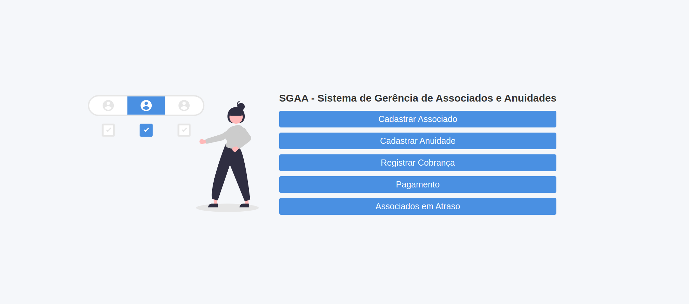

# SGAA - Sistema de Gerência de Associados e Anuidades



Um sistema de gerenciamento para a Associação "Devs do RN", desenvolvido em PHP puro, com o objetivo de facilitar a administração de associados e controle de pagamentos de anuidades.

Este projeto foi desenvolvido como parte do processo seletivo para a vaga Dev PHP 2024.2 da TecnoTech.

## Descrição do Projeto

Este sistema permite o cadastro de associados e a administração das anuidades. Seu objetivo é simplificar a gestão de pagamentos, oferecer uma consulta rápida do status de cada associado, e gerar relatórios de associados em dia ou em atraso com suas anuidades.

## Aprendizado

Durante o desenvolvimento deste projeto, explorei novos conceitos importantes, como o uso do PDO (PHP Data Objects) para interações seguras com o banco de dados e a implementação do padrão MVC (Model-View-Controller) para organizar o código de forma mais eficiente.

Implementei o MVC nos módulos de cadastro de associados e anuidades, estruturando melhor o fluxo de dados e garantindo uma separação clara entre as camadas de apresentação, lógica e dados. Utilizar o PDO em todas as consultas ao banco de dados foi um diferencial importante para a segurança e a escalabilidade da aplicação.

Esse projeto foi um grande desafio e estou satisfeito com os resultados alcançados até agora. Embora ainda veja oportunidades de melhorias, otimizações e novas funcionalidades, pretendo continuar evoluindo este sistema em breve.

Optei pelo MySQL como banco de dados devido à familiaridade adquirida ao longo da faculdade e em cursos, o que facilitou a construção e a gestão do sistema.

## Tecnologias e Ferramentas utilizadas

- **PHP (Puro, sem frameworks)**
- **HTML e CSS**
- **XAMPP** (Apache e MySQL)
- **Git** (Versionamento de código)
- **Modelo MVC** (Model, View, Controller)
- **PDO (PHP Data Objects)** para interação com o banco de dados de forma segura e estruturada
- **Técnica Mobile First** (Responsividade)

## Funcionalidades

- **Cadastro de Associados**: Registra informações como nome, e-mail, CPF e data de filiação.
- **Cadastro de Anuidades**: Define valores anuais das anuidades, com ajuste por ano.
- **Cobrança e Pagamento de Anuidades**: Exibe valores devidos, permite pagamento individual de anuidades e marca pagamentos como efetuados.
- **Verificação de Status**: Consulta associados com anuidades em dia ou em atraso.

## Instalação e Configuração

### Requisitos

- **PHP 7.4** ou superior
- **MySQL 5.7** ou superior
- **Servidor Web** (XAMPP, LAMP, MAMP, etc.)
- **Git** para controle de versão

### Passo 1: Clone o Repositório

```bash
git clone https://github.com/Fransuelton/desafio-php-tecnotech.git
cd desafio-php-tecnotech
```

### Passo 2: Configure o Servidor Web

- Coloque o projeto na pasta raiz do servidor (por exemplo, em `htdocs` para XAMPP ou LAMP).
- Certifique-se de que o servidor MySQL e o Apache estão ativos.

### Passo 3: Crie o Banco de Dados

1. Abra o phpMyAdmin ou qualquer cliente MySQL.
2. Crie um novo banco de dados chamado `associacao_dev` ou um nome de preferência.
3. Importe o arquivo `meu_database.sql` fornecido na raiz do projeto para criar as tabelas e seus relacionamentos.

### Passo 4: Configure o Acesso ao Banco de Dados

No arquivo `config.php`, ajuste as credenciais de acesso ao banco de dados:

```php
$host = 'localhost';
$dbname = 'associacao_dev';
$username = 'seu_usuario';
$password = 'sua_senha';
```

### Passo 5: Inicie o Servidor

Acesse o projeto no navegador, por exemplo, [http://localhost/desafio-php-tecnotech](http://localhost/desafio-php-tecnotech).

## Estrutura do Banco de Dados

O sistema é composto por três tabelas principais que organizam e registram informações sobre associados, anuidades, e o status de pagamento de cada associado.

- **Tabela `associados`**: Armazena as informações dos associados, incluindo nome, e-mail, CPF, e data de filiação. Cada registro representa um associado único da organização.

- **Tabela `anuidades`**: Registra os valores anuais das anuidades. Cada ano tem um valor específico associado à anuidade, permitindo a consulta do valor devido por período.

- **Tabela `cobrancas`**: Controla o status de pagamento das anuidades para cada associado, conectando cada associado a uma anuidade específica. Inclui um campo que indica se a anuidade foi paga, facilitando o monitoramento de pendências financeiras.

Para uma visão detalhada da estrutura e dos campos de cada tabela, consulte o arquivo `meu_database.sql`.

## Como Usar

1. **Cadastrar Associados**: Vá até a página de cadastro de associados e insira os dados necessários.
2. **Cadastrar Anuidade**: Acesse a área de gerenciamento de anuidades e registre o valor da anuidade para cada ano.
3. **Cobrança e Pagamento de Anuidades**: Verifique o status de pagamento dos associados e marque as anuidades como pagas ou em atraso.
4. **Consultar Status**: Acesse a página de associados em atraso para verificar os associados com pagamento que estão em atraso.

## Contribuições

Contribuições são bem-vindas! Abra um pull request ou envie sugestões para melhorias.
